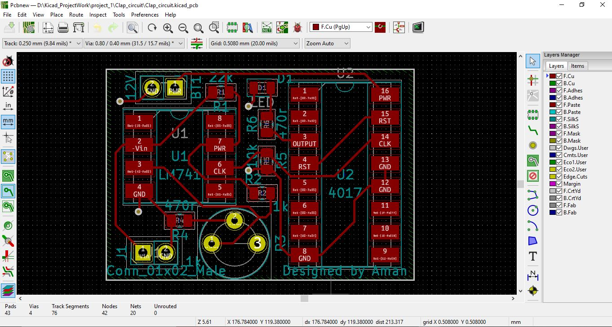

# Clap circuit
This circuit allows you to make Electrical home equipments will work on the basis of clapping sound. It's useful for IOTs project. Here we are using Single Side copper clad board PCB([Printed Circuit Board](https://en.wikipedia.org/wiki/Printed_circuit_board))

## Required Components

* ### MIC:
	It's a device which can convert sound signal into electrical signal. Here we are using [dynamic MIC](https://en.wikipedia.org/wiki/Microphone#Dynamic) which is work on the principle of electromagnetic induction.

* ### Operational Amplifier:
	Basicly it is only comparing two signals value(V or I), as the name indicates, it can perform many operation(like: Addition, Subtraction, integration, diffrentiation, comparision ,ADC,DAC etc). Here we are using it for analog signal to digital signal converter. We are using simple single core monolithic ic [LM741](https://en.wikipedia.org/wiki/Operational_amplifier) which have fundamental operation.

* ### Decade Counter:
	It's also known as [Johnson counter](https://en.wikipedia.org/wiki/Ring_counter#Johnson_counter). It's used fpr low range counting application(normally 0 to 10). It's a +ve edge triggering and 16 pin IC.
  
  
## Schematic Design

## PCB Layout Design
* ### Circuit Layaout

* ### 3D layout

